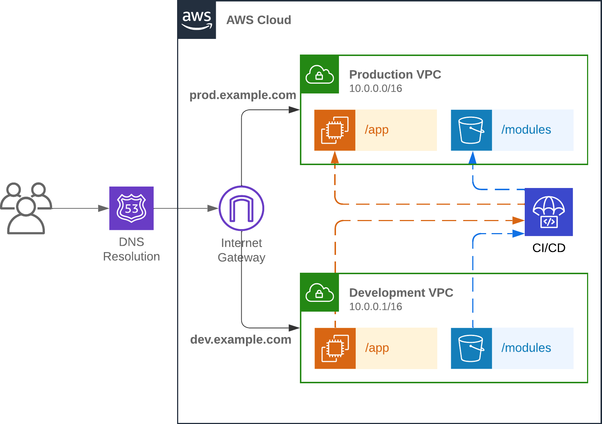

# Relative Paths to Remote Modules
This repository is an example of how relative paths can be used to import remote modules with [module federation](https://module-federation.io/).

Consider the following diagram that shows how two routes `/app` and `/modules` get routed to different vpns based on the base url specifying `dev.example.com` or `prod.example.com`.



In this example, both the remote modules, and the host application are served from the same domain, however that domain is not static.  Additionally both the host application and the remote modules can graduate to various environments, such as `dev`, `stage`, `prod`, `gov`, etc.  They graduate to these environments independent from each other, so a remote that is in active development will need to be tested against the application across all environments and vice-versa.

This repository is configured to demonstrate a host application and a static asset server that can host any number of federated modules.  The host application is spoofed with a proxy to redirect `/module` requests to the static asset server.  In a real world scenario this would be done through route configuration on a load balancer or reverse proxy such as nginx.

# Using Relative Paths
Module Federation can be configured to refer to remotes using a relative path.  This allows the host application to be agnostic to the environment that the remote modules are in.  The host application can request the remote modules using a relative path, such as `/modules/buttons`.  The module server will then serve the remote modules from the correct location based on the base url.

# The TypeScript Gap
Module federation has a really amazing feature that can resolve remote module TypeScript types at build time.  The main issue is that when using a relative path to specify the location of the remote module `manifest.json` file, the DTS plugin does not know the correct base url to use.  This is because the base url is not known at build time.  I've [filed a feature request to resolve this](https://github.com/module-federation/core/issues/2963), and [implemented a potential solution](https://github.com/module-federation/core/pull/3042).

# Directory Structure
There are 3 apps in this repository under the `/packages` folder.

- *host*: A module federation consumer application
- *module-server*: A simple express application that serves the remote modules
- *modules/buttons*: A module federation provider that exposes a `ConfettiButton` component.

# Installing and running the example

1. Clone the repository
```bash
git clone https://github.com/sbvice/mf-relative-path-example.git
cd mf-relative-path-example
```

2. Install the dependencies
```bash
nvm use
npm install
```

3. Build the federated modules
```bash
npm run build -w packages/modules
```

4. Start the module server
```bash
npm run start -w packages/module-server
```

5. Start the host application
```bash
npm run start -w packages/host
```

6. Open [http://localhost:3000](http://localhost:3000) to view the demo application in the browser.


https://github.com/user-attachments/assets/11bdabf8-21d6-48af-8c82-23cb321b3d3a


# Reproducing the bug
While the application loads and runs fine, there is a TypeScript warning when trying to compile the host application.

To reproduce this run:
```bash
npm run typecheck -w packages/host
```

The warning is:
```
error TS2307: Cannot find module 'buttons/ConfettiButton' or its corresponding type declarations.

2 import ConfettiButton from 'buttons/ConfettiButton';

Found 1 error in src/App.tsx:2
```

# Verifying the new `remoteBasePath` DTS config feature
I've created a [fork of the module federation core repository](https://github.com/sbvice/module-federation-core/tree/remote-path-base-dts) that implements the new `remoteBasePath` DTS config feature.  This feature is not yet merged into the main repository, but it can be used to verify that the feature works as expected.

To verify the feature:
1. Clone the forked repository
2. install and build the project
3. symlink `/node_modules/module-federation` to the cloned repository `/packages` subdirectory.
4. checkout the `fix` branch of this repository and run the host application at least once to pull the types.
5. Run the typecheck command again and verify that the warning is no longer present.

You now will actually see a bunch of other type errors now related to the `ConfettiButton` component which is a good thing! It indicates our types are being resolved correctly.
